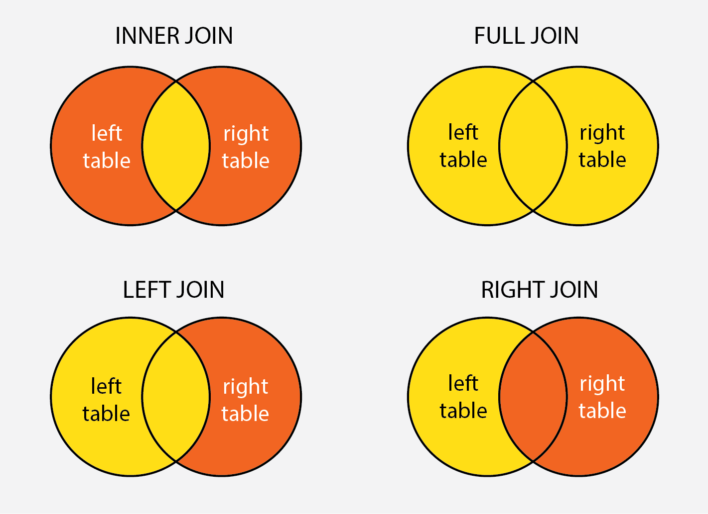

# Block 36 | Foreign Keys

[Slides](https://docs.google.com/presentation/d/e/2PACX-1vSu4RgF6y-DHfAUYxXwJb-Hn2kw1L_9mv5WmD7SywDGkGWT1A6rG2IZYD3ZCy6buxEbX-Mu4iH4rrIU/pub?start=false&loop=false&delayms=3000)\
[Guided Practice: DMV](https://github.com/FullstackAcademy/dmv)\
[Workshop: Filez](https://github.com/FullstackAcademy/filez)\
[Workshop Solution: Filez](https://github.com/FullstackAcademy/filez-solution)

## Action Items

- [ ] Complete and submit Block 36: Competency Check.
- [ ] Complete and submit Workshop: Filez.

## Learning Objectives

- Reference one table from another with a foreign key constraint
- Access multiple tables at once with join queries

## Vocabulary

- `FOREIGN KEY`, `REFERENCES`
  - referential integrity
- `ON DELETE`, `CASCADE`
- `JOIN`
  - inner
  - outer: left, right, full
- subquery
- alias, `AS`
- `to_json`, `json_agg`
- one-one (1-1)
- one-many (1-N)

## References

- [PostgreSQL documentation on joins, aliases, and subqueries](https://www.postgresql.org/docs/current/queries-table-expressions.html#QUERIES-JOIN)

